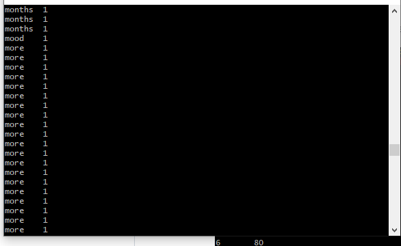
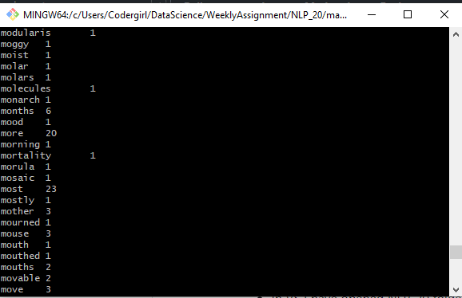
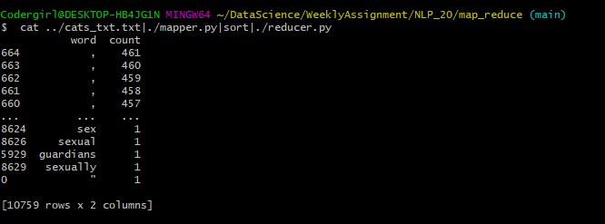
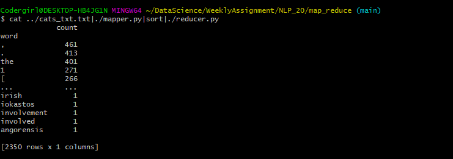

## 2. Steps I have used to create and run map-reducer py files 
* In VS I have opened NLP_20 folder. Under that folder created a new folder called map_reduce. Opened a mapper.py file inside map_reduce.

##### NLP_20 ------> map_reduce ------> mapper.py,reducer.py

* Used shebang line **#!/usr/bin/env python** which is path to the Bash interpreter. This ensures that bash will be used to interpret the script, even if its executed under different shell.

#### Mapper.py (we are going to break the sentences into tokens or chunks)
* Using standard input, getting input from the Bash command. Iterating our input inside loop to remove white spaces. Using **regex** separated punctuations from the word and **lowered all words** in list comprehension.

* To run our mapper.py file, In git bash use cat(concatenate) command for our cat_text file.
   **cat ../cats_txt.txt|./mapper.py|sort**

* In the above screen short we can see what my mapper does. It separated words from the sentences and printed it.

#### Reducer.py (taking the words from mapper and count it)
* Pipe command taking the output from mapper py file and giving it as an input to reducer file.
* Separated words and counts.
* created a dataframe using words and counts so that it will be easy for me to sort based on frequency of words with its unique values.
* My git bash command
  **cat ../cats_txt.txt|./mapper.py|sort|./reducer.py**
  
 
 
 * I uploaded an example for how reducer worked. In mapper screenshot we saw "more" word how many times it appeared. But reducer printed that word one time and number of frequencies. 
 
 
 
 * I have sorted using count. But if you see my above image it prints , for 461 times. It is printing the word with its number of items occurance. I used groupby and aggregated(max value) from the dataframe. 
 * Now I can see my punctuations and words sorted based on it frequency

 

Why mapreduce useful?
* Mapping involves sorting and filtering. MapReduce is suitable for iterative computation involving large quantities of data requiring parallel processing.
* MapReduce can work with minimal amount of memory and give results very fast.
