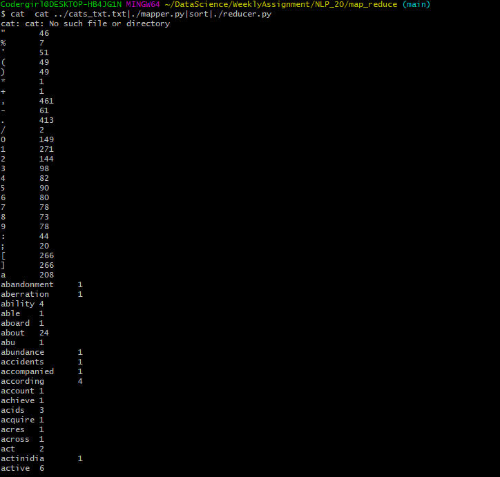
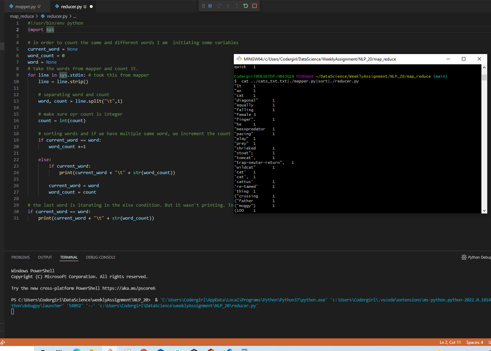

## Steps I have used to create and run map-reducer py files 
* In VS I have opened NLP_20 folder. Under that folder created a new folder called map_reduce. Opened a mapper.py file inside map_reduce.

##### NLP_20 ------> map_reduce ------> mapper.py,reducer.py

* Used shebang line **#!/usr/bin/env python** which is path to the Bash interpreter. This ensures that bash will be used to interpret the script, even if its executed under different shell.

#### Mapper.py (we are going to break the sentences into tokens or units)
* Using standard input, getting input from the Bash command. Iterating our input inside loop to remove white spaces. Using **regex** separated punctuations from the word and **lowered all words** in list comprehension.
* Printed words and punctuations
* To run our mapper.py file, In git bash use cat(concatenate) command for our cat_text file.
   **cat ../cats_txt.txt|./mapper.py|sort**

#### Reducer.py (taking the words from mapper and count it)
* Separated words and counts.
* created a dataframe using words and counts so that it will be easy for me to sort based on frequency of words with its unique values.
* My git bash command
  **cat ../cats_txt.txt|./mapper.py|sort|./reducer.py**
  
 
 
 
